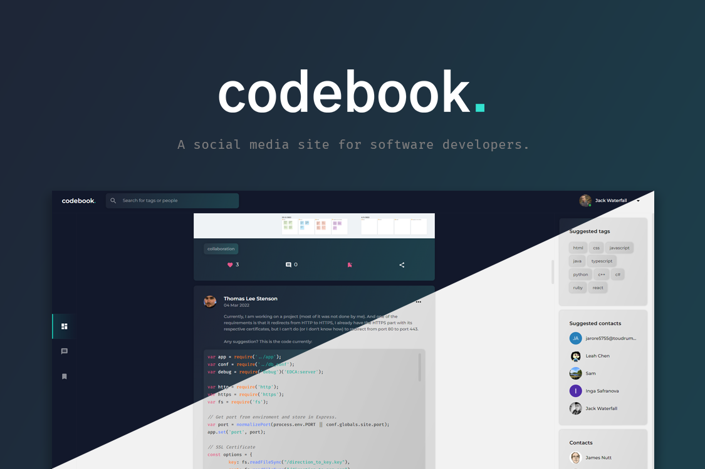

<h1 align="center">
  Codebook
</h1>
<p align="center">
 A social media site for developers built using NextJS and hosted on Netlify. It features posts with comments, replies, images, code snippets, tags and the ability to like, save and share posts. It also features an instant messaging feature with support for groups, you can visit it at <a href="https://codebook.space" target="_blank">codebook.space</a>
</p>

<p align="center">
  <a href="https://app.netlify.com/sites/codebookweb/deploys" target="_blank">
    
  </a>
</p>

## Installation

1. Install the required dependencies

   ```sh
   npm install
   ```

2. Start the development server

   ```sh
   npm run dev
   ```

## Building for production

1. Generate a production build

   ```sh
   npm run build
   ```

2. Start the server

   ```sh
   npm start
   ```
